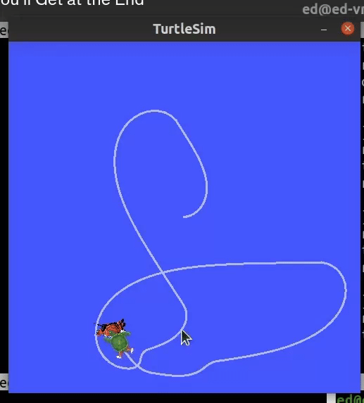

# ROS2 Turtle Catch Game

A fun and interactive ROS2 project where one turtle needs to catch randomly spawning turtles in the TurtleSim environment. The main turtle is controlled by the user, and the goal is to catch all the randomly appearing turtles.

## Overview

This project demonstrates:
- ROS2 node creation and communication
- TurtleSim manipulation
- Service and topic usage in ROS2
- Random turtle spawning mechanics
- Collision detection implementation

## Demo



*In this demo, the blue turtle is controlled by the user while other colored turtles spawn randomly. The goal is to catch them all!*

## Prerequisites

- Ubuntu 22.04 (or compatible OS)
- ROS2 Humble Hawksbill
- Python 3.10 or later
- TurtleSim package

```bash
sudo apt install ros-humble-turtlesim
```

## Project Structure

```
turtle_catch/
├── turtle_catch/
│   ├── __init__.py
│   ├── turtle_controller.py
│   ├── turtle_spawner.py
│   └── collision_detector.py
├── launch/
│   └── turtle_catch.launch.py
├── docs/
│   └── images/
│       ├── turtle_catch_demo.gif
│       ├── game_start.gif
│       ├── catching.gif
│       └── game_over.gif
├── package.xml
├── setup.py
└── setup.cfg
```

## Installation

1. Create a ROS2 workspace (if you haven't already):
```bash
mkdir -p ~/ros2_ws/src
cd ~/ros2_ws/src
```

2. Clone this repository:
```bash
git clone https://github.com/your_username/turtle_catch.git
```

3. Build the package:
```bash
cd ~/ros2_ws
colcon build --packages-select turtle_catch
source install/setup.bash
```

## Usage

1. Launch the game:
```bash
ros2 launch turtle_catch turtle_catch.launch.py
```

2. Control the main turtle:
- Use the keyboard arrow keys to move
- Press 'q' to quit the game

## Node Description

### 1. Turtle Controller Node
- Controls the main turtle's movement
- Subscribes to keyboard input
- Publishes velocity commands

### 2. Turtle Spawner Node
- Randomly spawns new turtles at intervals
- Manages turtle creation and removal
- Keeps track of active turtles

### 3. Collision Detector Node
- Monitors positions of all turtles
- Detects when the main turtle catches others
- Updates score and removes caught turtles

## Parameters

The following parameters can be configured in the launch file:

- `spawn_interval`: Time between new turtle spawns (default: 5.0 seconds)
- `max_turtles`: Maximum number of turtles on screen (default: 5)
- `catch_distance`: Distance threshold for catching turtles (default: 0.5 units)

## Topics

### Published Topics
- `/turtle1/cmd_vel` (geometry_msgs/msg/Twist): Main turtle velocity commands
- `/score` (std_msgs/msg/Int32): Current score

### Subscribed Topics
- `/turtle1/pose` (turtlesim/msg/Pose): Main turtle position
- `/other_turtles/poses` (turtlesim/msg/Pose
